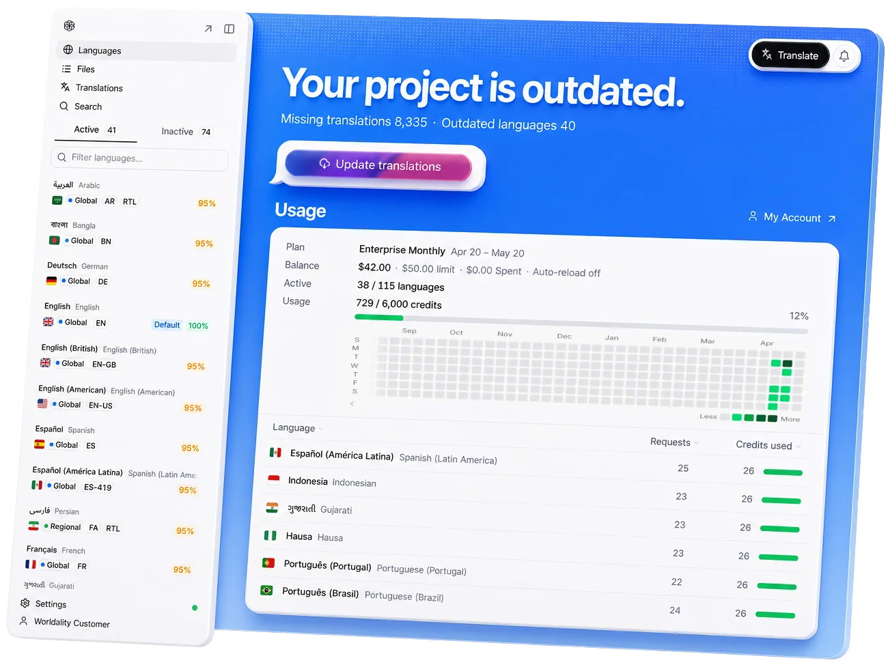
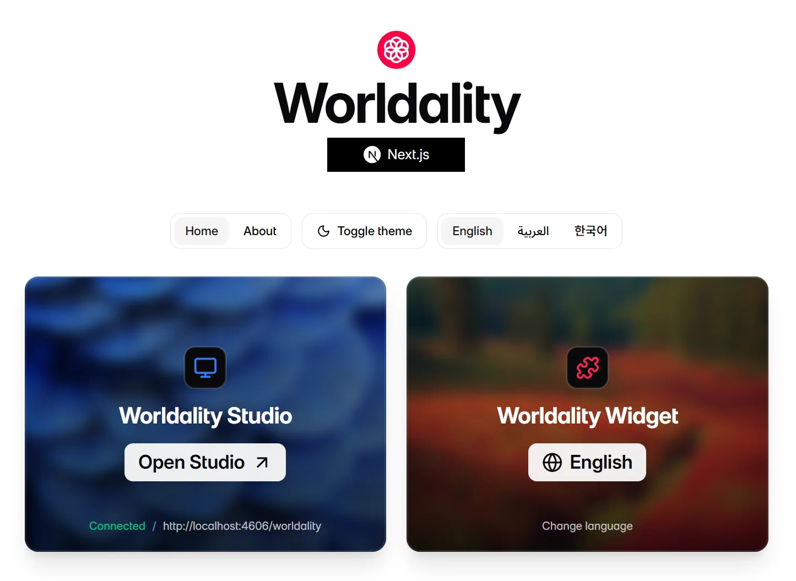

# Worldality: Make Your Website Global

Make your website global with Worldality, an internationalization platform built for developers and enterprise teams that turns websites into global products, reaching audiences in over 120 languages with an experience that feels local.

Worldality is framework-agnostic and made for custom-built websites and apps across React, Next.js, Vue, Nuxt, Svelte, and more. It combines live translation, language-based routing, translated page metadata, a language switcher, text detection, Worldality CLI, and Worldality Studio for browsing strings, translating content, and tracking progress.



### [Learn more at Worldality.com](https://worldality.com/)

This repository is the public home for runnable Worldality examples and support discussions. Each example uses the published [`worldality`](https://www.npmjs.com/package/worldality) package from npm.

## Available Examples

- `examples/react`
- `examples/solid`
- `examples/vue`
- `examples/nextjs`
- `examples/nuxt`
- `examples/astro`
- `examples/sveltekit`
- `examples/react-router`
- `examples/vanilla`

## Preview



## Install

```bash
bun install
```

## Run All Examples

```bash
bun run examples
```

This starts every example on fixed local ports starting at `http://localhost:4600`.
Use `bun run examples --no-open` to start the servers without opening browser tabs.

## Run One Example

```bash
bun run dev:react
bun run dev:nextjs
bun run dev:vue
```

## Build

```bash
bun run build
```

## Get Worldality

Start the guided setup from your app's project root:

```bash
# npm
npx worldality

# pnpm
pnpm dlx worldality

# bun
bunx worldality

# yarn
yarn dlx worldality

# deno
deno run -A npm:worldality
```

If you prefer to install the package first, run setup after installing it:

```bash
# npm
npm install worldality
npx worldality setup

# pnpm
pnpm add worldality
pnpm dlx worldality setup

# bun
bun add worldality
bunx worldality setup

# yarn
yarn add worldality
yarn dlx worldality setup

# deno
deno add npm:worldality
deno run -A npm:worldality setup
```

## Issues

Use this repository for public bug reports, example issues, and support questions.
