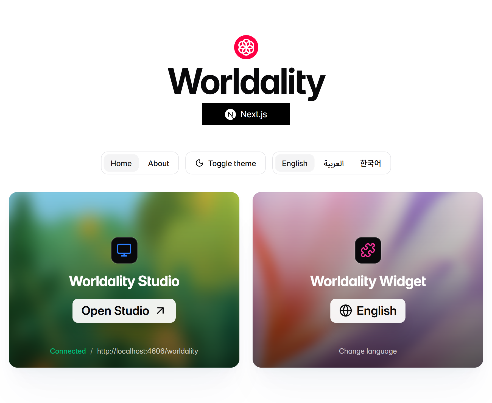

# Worldality

Framework examples and support hub for Worldality.

Worldality is published on npm as [`worldality`](https://www.npmjs.com/package/worldality).
Each example app depends on `worldality@^0.1.0` from npm.

## Available Examples

- `react`
- `solid`
- `vue`
- `nextjs`
- `nuxt`
- `astro`
- `sveltekit`
- `react-router`
- `vanilla`

## Preview




## Install

```bash
bun install
```

## Run All Examples

```bash
bun run examples
```

This starts every example on fixed local ports starting at `http://localhost:4600`.
Use `bun run examples --no-open` to start the servers without opening browser tabs.

## Run One Example

```bash
bun run dev:react
bun run dev:nextjs
bun run dev:vue
```

## Build

```bash
bun run build
```

## Get Worldality

Start the guided setup from your app's project root:

```bash
npx worldality
```

If you prefer to install the package first, run setup after installing it:

```bash
npm install worldality
npx worldality setup
```

You can also use your package manager's equivalent install command, such as `bun add worldality`, `pnpm add worldality`, or `yarn add worldality`, then run `npx worldality setup`.

## Issues

Use this repository for public bug reports, example issues, and support questions.
